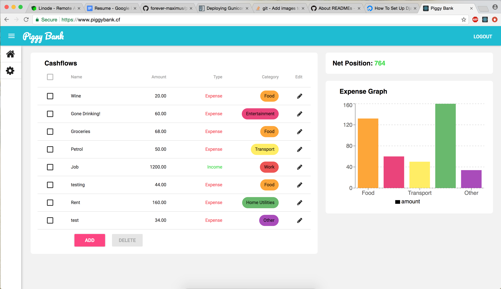

# Piggy Bank - NO LONGER ACTIVE - ONLY FOR REFERENCE
A web application for managing personal finances.

Add expenses and incomes to track weekly spending and reach saving goals. Ability to set categories for cashflows, allowing expenses to be grouped together. Includes a visualisation of expense data by category.

Currently there is no way to register new users as development is still in early phases. However, a user has been created for testing purposes:

username: piggybank_tester  
password: mansnothot

# Upcoming Features
- Responsive display for mobile
- Ability to add user defined categories
- Register new users
- View expenses by month or week
